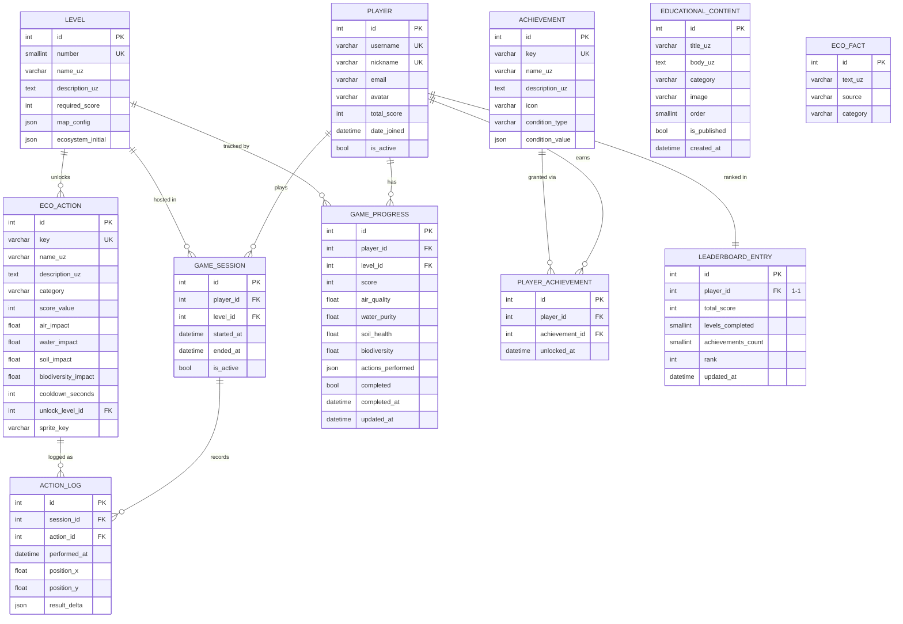

# Приложение В. ER-диаграмма базы данных EcoGame

Диаграмма описывает полную схему реляционной базы данных приложения EcoGame
(11 таблиц). Разработана с применением нотации Crow's Foot (ГОСТ не
регламентирует нотацию ER-диаграмм).

## Пояснения к схеме

| Таблица | Назначение |
|---------|-----------|
| `PLAYER` | Расширенная модель пользователя Django (AbstractUser) |
| `LEVEL` | Описание уровня: карта, начальные параметры экосистемы |
| `ECO_ACTION` | Каталог экологических действий с коэффициентами влияния |
| `GAME_SESSION` | Факт начала и завершения одной игровой сессии |
| `GAME_PROGRESS` | Накопительный прогресс игрока по уровню (unique: player+level) |
| `ACTION_LOG` | Лог каждого отдельного действия с координатами на карте |
| `ACHIEVEMENT` | Определение достижения и условий его разблокировки |
| `PLAYER_ACHIEVEMENT` | M2M связь игрок ↔ достижение с датой разблокировки |
| `EDUCATIONAL_CONTENT` | Образовательные статьи на узбекском языке |
| `ECO_FACT` | Короткие экологические факты для экранов загрузки |
| `LEADERBOARD_ENTRY` | Денормализованная таблица рейтинга (O(1) чтение) |

## Ключевые архитектурные решения

1. **Денормализованный `LEADERBOARD_ENTRY`**: вместо агрегатного запроса по
   `GAME_PROGRESS` таблица лидеров обновляется Django-сигналами при каждом
   сохранении прогресса. Это обеспечивает O(1) чтение рейтинга при любом
   количестве игроков.

2. **JSONField для `map_config` и `ecosystem_initial`**: позволяет хранить
   гибкую конфигурацию каждого уровня без дополнительных таблиц. PostgreSQL
   обеспечивает нативную поддержку JSONB с индексированием.

3. **`unique_together("player", "level")` в `GAME_PROGRESS`**: гарантирует
   атомарность прогресса — один игрок имеет ровно один экземпляр прогресса
   на каждый уровень. Повторное прохождение обновляет существующую запись.

4. **`result_delta` в `ACTION_LOG`**: снимок изменения индикаторов в момент
   действия позволяет воспроизвести историю сессии и строить аналитику без
   перерасчёта.
