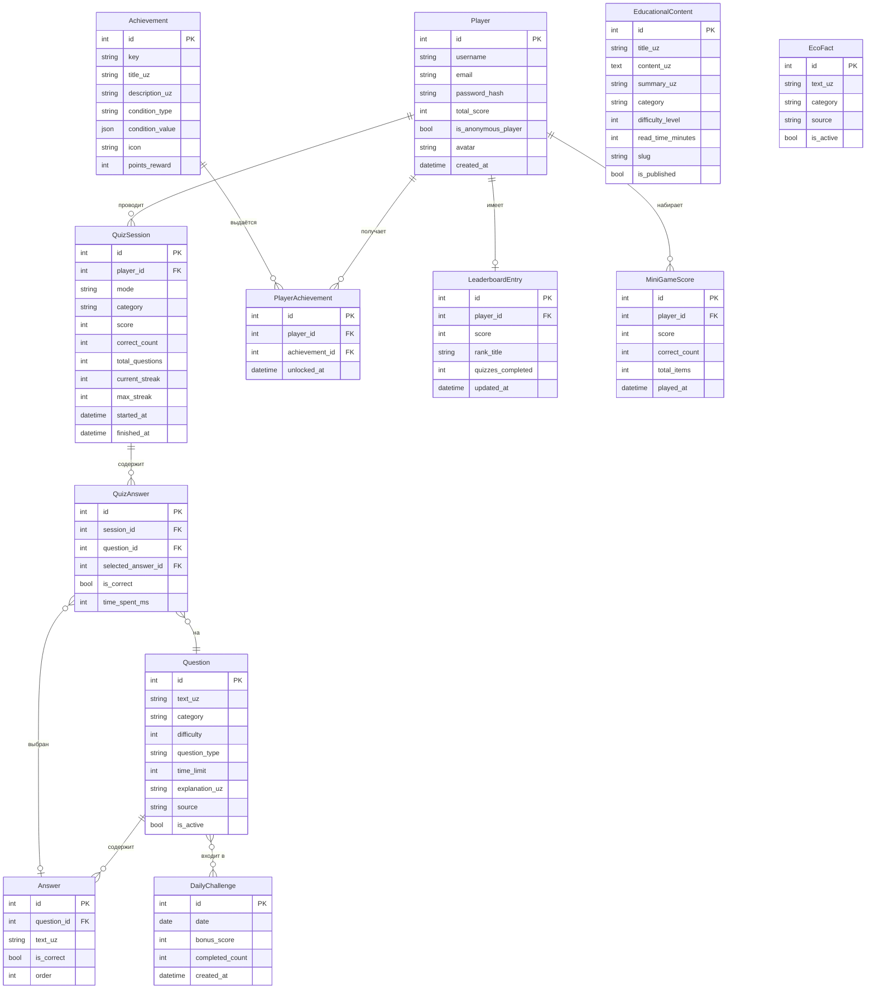

# ПРИЛОЖЕНИЕ В. ER-ДИАГРАММА БАЗЫ ДАННЫХ

## В.1 ER-диаграмма в нотации Mermaid

## В.2 Описание связей

| Связь | Кратность | Описание |
|-------|-----------|---------|
| Player → QuizSession | 1:N | Один игрок может иметь много сессий |
| Player → LeaderboardEntry | 1:1 | У каждого игрока одна запись в лидерборде |
| Player → PlayerAchievement | 1:N | Игрок может иметь много достижений |
| Question → Answer | 1:N | Вопрос имеет 2 или 4 варианта ответа |
| Question ↔ DailyChallenge | N:M | Вопросы могут входить в несколько ежедневных заданий |
| QuizSession → QuizAnswer | 1:N | Сессия содержит ответы на все вопросы |
| QuizAnswer → Answer | N:1 | Каждый ответ ссылается на выбранный вариант |
| Achievement → PlayerAchievement | 1:N | Достижение может быть выдано многим игрокам |

## В.3 Ключевые ограничения целостности

- `LeaderboardEntry.player` — UNIQUE (OneToOneField)
- `PlayerAchievement(player, achievement)` — UNIQUE TOGETHER
- `DailyChallenge.date` — UNIQUE
- `Answer.is_correct=True` — ровно один для MCQ вопросов (NOT ENFORCED на DB уровне, проверяется в QuizService)
- `QuizAnswer(session, question)` — UNIQUE TOGETHER (защита от повторного ответа)
